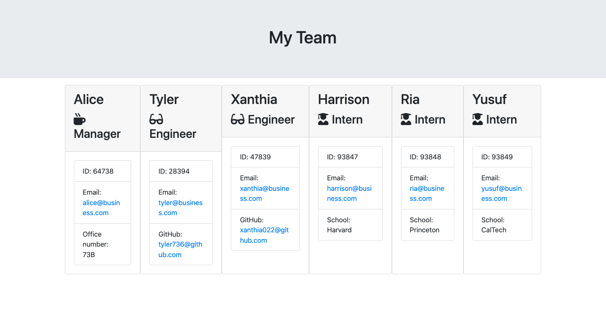

# efficient-team-profile-generator
This is a functional Node.js command-line application designed to gather information about team members in a software engineering team and generate an HTML webpage displaying summaries for each person.

## Description 
The primary objective of this project was to create a command-line application using Node.js to collect user input and dynamically generate team cards based on that input. The application incorporates Jest testing to ensure the fulfillment of design goals.

Given the project's nature, no additional HTML or CSS elements were created, and the provided starter template was used without additional formatting. Consequently, the README file is displayed on the homepage.

**https://nonebula.github.io/efficient-team-profile-generator**

## Table of Contents

* [Installation](#installation)
* [Usage](#usage)
* [Credits](#credits)
* [Tests](#tests)
* [License](#license)

## Installation
This project is a website hosted on GitHub. To access and use the website, follow these steps:

1. **Open your web browser:** Launch your preferred web browser.
2. **Visit the project repository:** **https://nonebula.github.io/efficient-team-profile-generator**
3. **Download the code:** Navigate through GitHub to download the code and run the program through the command-line interface in your text editor.

If you encounter any issues or have questions, please refer to the documentation or contact the developers.

## Usage 

To navigate to the relevant section of the website, open the console using the 'inspect' tool. Click the tab 'Console' and you will be able to view what has been done. The screenshot below shows the page screenshot. Should the page fail to load in the presented format, make sure to load it up on a desktop monitor. 

## Tests 

Run tests by typing 'npm test' into the command-line.

## Credits

The project was completed independently but built off the source code from: edX Boot Camps LLC. I worked with a friend, Sam Millar, to explore the fundamentals of Javascript and clarify my work. I also worked through the modules on Codecademy to better develop my understanding to enable me to solve these challenges. In producing this webpage, I also utilized a range of tutorials from W3 Schools and referred to multiple posts on Stack Overflow.

## License

MIT License

Copyright (c) 2023 nonebula

Permission is hereby granted, free of charge, to any person obtaining a copy
of this software and associated documentation files (the "Software"), to deal
in the Software without restriction, including without limitation the rights
to use, copy, modify, merge, publish, distribute, sublicense, and/or sell
copies of the Software, and to permit persons to whom the Software is
furnished to do so, subject to the following conditions:

The above copyright notice and this permission notice shall be included in all
copies or substantial portions of the Software.

THE SOFTWARE IS PROVIDED "AS IS", WITHOUT WARRANTY OF ANY KIND, EXPRESS OR
IMPLIED, INCLUDING BUT NOT LIMITED TO THE WARRANTIES OF MERCHANTABILITY,
FITNESS FOR A PARTICULAR PURPOSE AND NONINFRINGEMENT. IN NO EVENT SHALL THE
AUTHORS OR COPYRIGHT HOLDERS BE LIABLE FOR ANY CLAIM, DAMAGES OR OTHER
LIABILITY, WHETHER IN AN ACTION OF CONTRACT, TORT OR OTHERWISE, ARISING FROM,
OUT OF OR IN CONNECTION WITH THE SOFTWARE OR THE USE OR OTHER DEALINGS IN THE
SOFTWARE.